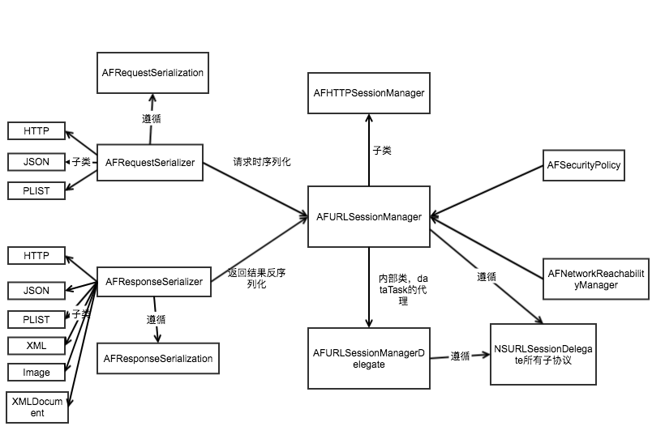

# AFNetworking 3.0 源码浅析

> 摘要: AFNetworking 3.0 基于NSURLSession进行网络请求，最关键的地方其实还是NSURLRequest与NSURLSessionTask的构建。

## AFN结构图

## 一次完整的AFN请求流程

1. 构建__AFURLSessionManager__ :
<pre><code>- (instancetype)initWithSessionConfiguration:(NSURLSessionConfiguration *)configuration;
</code></pre>
在该构造方法中，会涉及到__NSURLSession__的构造，该过程中，将设置自己为__NSURLSessionDelegate__的代理，该代理的调用会调用到专门处理与sessionTask相关的 __AFURLSessionManagerTaskDelegate__的方法。

2. 构建__NSURLSessionTask__ -- 利用AFURLSessionManager构建,其中需要__NSURLRequest__类型的参数:
<pre><code>- (NSURLSessionDataTask *)dataTaskWithRequest:(NSURLRequest *)request
                                completionHandler:(nullable void (^)(NSURLResponse *response, id _Nullable responseObject,  NSError * _Nullable error))completionHandler DEPRECATED_ATTRIBUTE;
</code></pre>

3. 构建__NSURLRequest__ -- 遵循AFURLRequestSerialization协议的方法构建。其中会分为NSURLSessionDataTask, NSURLSessionUploadTask和NSURLSessionDownloadTask的构建。以NSURLSessionDataTask中的一个构造方法为例：
<pre><code>- (NSURLRequest *)requestBySerializingRequest:(NSURLRequest *)request
                                   withParameters:(id)parameters
                                            error:(NSError *__autoreleasing *)error;
</code></pre>

4. 最后，在构建出来的NSURLSessionTask中，执行[task resume]方法，实现一次网络请求。

## AFRequestSerializer

