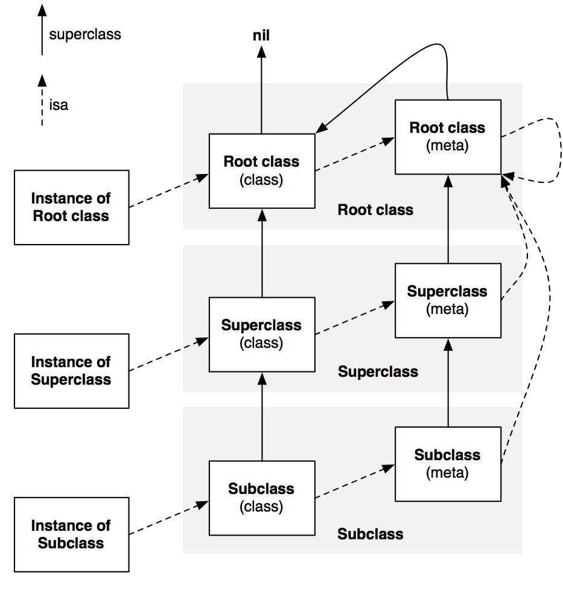

# Runtime的理解与使用
> 摘要： Objective-C是动态语言，所谓动态语言，就是指在程序运行的时候能动态改变程序结构，如：新方法被增删、动态改变方法表的键值对（method-swizzling）甚至动态改变类的继承链（isa-swizzling）。runtime就是可以实现语言动态的一组API。

## runtime中的Class
1. 基本概念：
	* isa: 一个指向实例或类的根类或元类的指针。
	* SEL:类成员方法的指针，但不同于C语言中的函数指针，函数指针直接保存了方法的地址，但SEL只是方法编号。
	* IMP:一个函数指针,保存了方法的地址，与SEL的关系类似Key-Value键值对。
	* Method:方法的结构体，其中保存了方法的名字，实现和类型描述字符串。
2. objc\_class结构体

	```objc
	struct objc_class {
	    	Class isa  OBJC_ISA_AVAILABILITY;
		#if !__OBJC2__
		    Class super_class
		    const char *name
	   	 	long version
	   	 	long info
	   	 	long instance_size
	   	 	struct objc_ivar_list *ivars
	   	 	struct objc_method_list **methodLists
	   	 	struct objc_cache *cache
	   	 	struct objc_protocol_list *protocols 
	   	#endif
	} OBJC2_UNAVAILABLE;
	```
	
3. isa和super class指向图（引用自[Objective-C Runtime](http://yulingtianxia.com/blog/2014/11/05/objective-c-runtime/)）
 
 
	`-isKindOfClass:`判断是否是这个类或者这个类的子类的实例。
	
	`-isMemberOfClass:`判断是否是这个类的实例，需要完全匹配才返回true。

4. 由`objc_class`结构体可以知道，Class类中包含方法`cache`，用于存储已经访问过的方法列表。因为通常的调用方法过程为：从当前类开始，沿着继承方向一步步遍历寻找`methodLists`。如果`cache`中含有要调用的方法，就可以不必遍历寻找，是一种空间换时间的妥协。
5. 当方法调用时，如果沿结构体的继承路径都寻找不到需要调用的方法时，就会依次启用动态方法解析、备用接收者以及完整消息转发三个阶段。如果还是找不到，就会报`dose not recognize selector`这个错。

## 动态方法解析

消息发送的流程如下图所示，当[reciever selector]调用，但reciever并不存在selector方法时，可以依次使用动态方法解析、备用接受者和完整消息转发来避免crash。当然，所花费的代价也依次递增，所以应当尽可能早地处理。


动态方法解析，是指使用`+ (BOOL)resolveInstanceMethod:(SEL)sel`或者`+(BOOL)resolveClassMethod:(SEL)sel`方法，截取选择子SEL，再使用`runtime`的类API动态添加方法。具体代码如下：

```objc
+ (BOOL)resolveInstanceMethod:(SEL)sel {
	if (sel == @selector(relayMethod)) {
		class_addMethod([self class], sel, (IMP)dynamicMethodIMP, "v@:");
		return YES;
		NSLog(@"resolveInstanceMethod sel is %@", NSStringFromSelector(sel));
	}
	return [super resolveInstanceMethod:sel];
}

void dynamicMethodIMP(id self, SEL _cmd)
{
	NSLog(@"动态转发成功%@", NSStringFromSelector(_cmd));
	((Person *)self).age = 10;
	NSLog(@"%d", ((Person *)self).age);
}

```

## 备援接收者
当动态方法解析失败后，还可以使用备援接收者来避免crash。思路是使用其他类作为消息的接收者，以此实现方法的最终调用。`- (id)forwardingTargetForSelector:(SEL)aSelector `是其核心方法。代码如下：

```objc
- (id)forwardingTargetForSelecotr(SEL)aSelector {
	BackupClass *backup = [BackupClass new];
	if ([backup respondsToSelector: aSelector]) {
		return backup;
	}
	return [super forwardingTargetForSelecotr:aSelector];
}

```


## 完整消息转发
当动态方法解析和备援接收者都失败后，完整消息转发是避免crash的最后屏障。首先需要利用`-methodSignatureForSelector:`创建`NSMethodSignature`对象（存储方法的类型、返回类型和参数），再利用`NSMethodSignature`创建`NSInvocation`类（把消息转换为对象的类），最后使之作为入参调用`forwardInvocation:`方法。使用的例子如下：

```objc
- (NSMethodSignature *)methodSignatureForSelector:(SEL)aSelector {
	 if (aSelector ==@selector(setJob:)) {
		return [NSMethodSignature signatureWithObjCTypes:"v@:@"]; // last @ for parameter
	} else if (aSelector == @selector(job)) {
		return [NSMethodSignature signatureWithObjCTypes:"@@:"]; // @ for return value is nsstring
	}
	return [super methodSignatureForSelector:aSelector];
}

- (void)forwardInvocation:(NSInvocation *)invocation
{
	//拿到函数名
	NSString *key = NSStringFromSelector([invocation selector]);
	if([invocation selector] == @selector(setJob:)) {
		//setter函数形如 setXXX: 拆掉 set和冒号
		key = [[key substringWithRange:NSMakeRange(3, [key length]-4)] lowercaseString];
		NSString *value;
		//从参数列表中找到值
		[invocation getArgument:&value atIndex:2];
		[_data setValue:value forKey:key];
		
	} else if ([invocation selector] == @selector(job)) {
		NSString * value = [_data objectForKey:key];
		[invocation setReturnValue:&value];
	}
}

```

## 主要应用
1. 关联对象

	Category可以为一个已经存在的类动态声明属性，但由于类的内存布局在编译时已经固定，并不能动态添加成员变量。所以系统也只是声明了一个setter和getter，实现还是需要自己动手。利用关联对象，`objc_getAssociatedObject`和`objc_setAssociatedObject`分别在getter和setter中读取和取出存在全局字典中的值，来实现和普通属性的效果。

2. method-swizzling

	俗称“黑魔法”，在运行时动态交换`SEL`对应的`IMP`，实现交换方法的效果。某些系统方法是黑盒，但当我们想监听打印其调用过程时，可以利用method-swizzling，把系统方法替换成我们写的方法，在其中加入`NSLog`来打印信息即可。
	
3. isa-swizzling

	在运行时为实例的isa指向一个派生类，该派生类作为实例的原来isa类的子类，动态添加自己想要的方法，以隐式实现一些功能。`KVO`就是利用这个黑科技实现的。具体可见我的另外一篇博文：[KVO底层原理小结.md](https://github.com/VincentZhangZhipeng/blog/blob/master/2018-4-15/KVO%E5%BA%95%E5%B1%82%E5%8E%9F%E7%90%86%E5%B0%8F%E7%BB%93.md)。

##Reference
1. [iOS-runtime通篇详解-上](http://www.cocoachina.com/ios/20170424/19102.html)
2. [iOS底层知识-runtime详解](http://blog.csdn.net/u011363981/article/details/61917872)
3. [iOS关联对象技术原理](https://mp.weixin.qq.com/s/X_gCjdoTxIBUr1hZApiwow)
4. [isKindOfClass和isMemberOfClass](http://www.nscookies.com/runtime-objectmodel/)